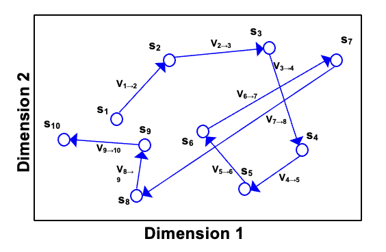
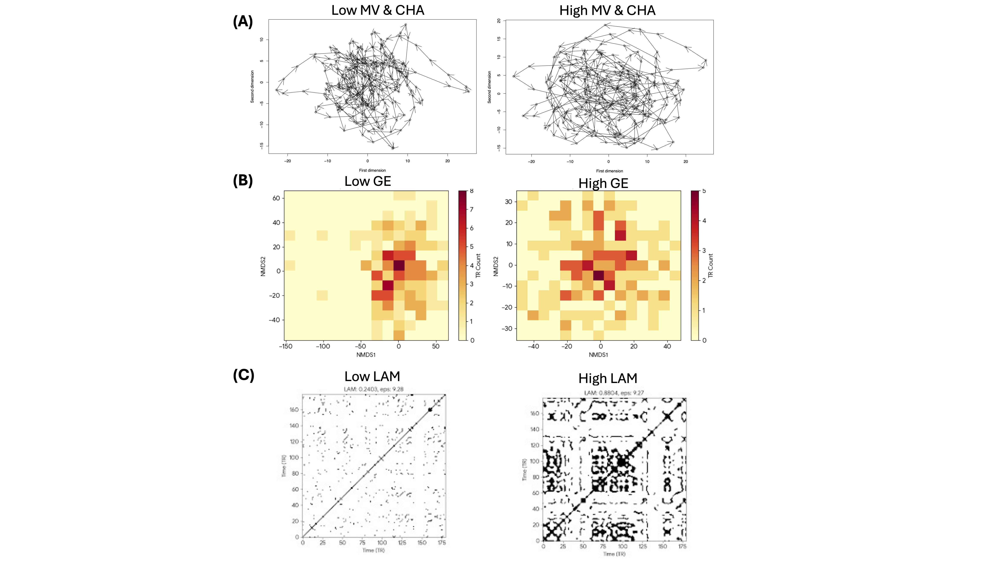

# HSU_project

Bonjour!! I'm Chun-Wei, a postdoc from Taiwan under Joshua's lab at National Taiwan University (NTU). :)

My current research project focuses on functional state transitions in the brain, exploring how these dynamics relate to psychological resilience and cognitive aging. 

Here is our recent paper on functional state transitions in the Default Mode Network and how it associates with psychological resilience:
[Read the full paper here](https://doi.org/10.1016/j.neuroimage.2025.121508)

<a href="https://github.com/gracehsu">
  
  <br /><sub><b>Chun-Wei</b></sub>
</a>

---

# 🧠 stateMDS: Automated Functional State Dynamics Pipeline

## 📊 Project Presentation

### 📌 Introduction
This project focuses on transforming an existing neuroimaging analysis framework—`stateMDS`—into a streamlined, fully open-source tool. 

Currently, `stateMDS` quantifies and visualizes the dynamic trajectories of brain network states using resting-state fMRI (rsfMRI) data. Historically, this workflow required manual execution across proprietary software environments (MATLAB/SPM). This project bridges that gap by integrating Python and `nilearn`, making the methodology entirely open-source, reproducible, and ready for automated deployment on local machines or compute clusters.

---

### 🎯 Goal
The goal of this project was to turn my current analyses into a **fully reproducible, automated pipeline**—and we succeeded.

#### 📍 Primary Objective
> Build a master shell script (`run_stateMDS.sh`) that takes a pre-extracted matrix of time points × voxels (saved as a `.csv` file) and automatically executes the entire R-based multidimensional scaling and visualization pipeline.

#### 🚀 BrainHack Stretch Goals (Achieved!)
* [x] **Upstream Integration:** Replaced the MATLAB-based voxel extraction script with a dynamic Python/Nilearn ingestion script.
* [x] **Open Data Application:** Built an end-to-end pipeline (`opendata_ADHD.py`) that successfully pulls and processes the ADHD-200 dataset directly from OpenNeuro.
* [x] **Mask Generation:** Automated the generation of subject-space ROI masks using standard atlases (e.g., Schaefer, AAL) directly within Python.

---

### 🔬 Background of this Analysis
The core concept of this methodology relies on evaluating brain activity as a dynamic spatial pattern rather than just averaging signals across a region.

* **Functional State:** The spatial pattern of multi-voxel BOLD signal intensities captured at a single time point (TR) within a predefined network or ROI.
* **State Transition:** The temporal change in this multi-voxel pattern. By quantifying frame-by-frame changes, we capture the continuous trajectory of a network’s activity.
* **Dimensionality Reduction:** Because voxel-wise patterns are highly dimensional, Non-metric Multidimensional Scaling (NMDS) is used to project these states into a lower-dimensional space.

<p align="center">
  
</p>
<p align="center">
  <em>Example of a 2D state space trajectory. The arrows represent step-by-step transitions (velocity) between functional states over time.</em>
</p>

### 📊 Schematic of Functional State Indices

To quantify the dynamic trajectory of brain states, we calculate several topological and dynamic indices:

<p align="center">
  
</p>

* **(A) Mean Velocity (MV):** The step-by-step Euclidean distance between consecutive TRs, representing the speed of state transition.
* **(A) Convex Hull Area (CHA):** A topological measure of the total state-space volume explored by the network over the scan duration.
* **(B) Grid Entropy (GE):** A measure of state-space distribution and occupancy. High entropy indicates a diverse, widely varying sequence of states, while low entropy indicates highly repetitive states.
* **(C) Laminarity (LAM):** Derived from Recurrence Quantification Analysis (RQA), indicating the tendency of the brain to get "stuck" in a specific state before transitioning.

---

## 💻 The Unified Open-Source Workflow

The `stateMDS` pipeline now smoothly bridges the gap between BIDS-compliant preprocessing and our dynamic state analysis without any proprietary software dependencies.

* **Stage 1: Open Data Ingestion (Python)** - Fetches preprocessed fMRI data (e.g., ADHD-200), strictly matches TR parameters, and manages hard drive caching.
* **Stage 2: Voxel-wise Time Series Extraction (Nilearn)** - Applies network atlases (Schaefer/AAL), standardizes scan lengths across cohorts to ensure fair velocity comparisons, detrends the signal, and outputs clean `.csv` matrices.
* **Stage 3: Dynamic State Analysis (Bash/R)** - Python automatically triggers the `run_stateMDS.sh` script, which ingests the matrices, computes dynamic indices (Velocity, CHA, GE, LAM), and generates automated trajectory plots.

### 📦 Prerequisites
You will need both Python and R to run the full end-to-end pipeline.

**Python Dependencies:**
It is highly recommended to use a virtual environment (e.g., `.venv`).
```bash
pip install numpy pandas nilearn scikit-learn nibabel matplotlib
```

**R Dependencies:**
Run this inside your R console:
```R
install.packages(c("optparse", "vegan", "readr", "fs", "dplyr", "geometry", "entropy", "fields", "ggplot2"))
```

### 📂 Project Structure
```text
stateMDS/
├── opendata_ADHD.py              # Master Python Ingestion Script
├── run_stateMDS.sh               # Master Bash Pipeline
├── R/
│   ├── run_mds_analysis.R        # Step 1: NMDS & Velocity
│   ├── run_brain_indices.R       # Step 2: CHA, GE, LAM
│   └── visualize_trajectories.R  # Step 3: Plotting
└── data/
    └── voxels/                   # Auto-generated target directory for CSVs
```

---

### 🚀 Quick Start

#### Route 1: End-to-End Open Data Pipeline (Recommended)
Want to test the pipeline immediately without providing your own data? Run the Python master script. It will automatically download the ADHD-200 dataset, find a balanced cohort matching a specific TR, extract the Default Mode Network, standardize the matrix sizes, and seamlessly trigger the R pipeline.

```bash
python opendata_ADHD.py
```

#### Route 2: Bring Your Own Data (Local Execution)
If you already have a folder of Time points × Voxels `.csv` files, you can skip the Python ingestion and run the Bash wrapper directly. 

Make the script executable (only needed once):
```bash
chmod +x run_stateMDS.sh
```

Run the pipeline:
```bash
./run_stateMDS.sh -d data/my_custom_voxels -o output_custom
```

### ⚙️ Advanced Usage & Customization
You can fully customize the `run_stateMDS.sh` behavior using terminal flags:

* `-d` : Input directory containing TSV/CSV files (Default: `data/voxels`)
* `-o` : Main output directory (Default: `output_stateMDS`)
* `-t` : Maximum TRs to analyze per subject (Dynamically set by Python script, or default: `180`)
* `-s` : Maximum acceptable NMDS stress value (Default: `0.15`)
* `-k` : Maximum dimension to test (Default: `10`)

**Example: Forced 2D Visuals**
Run this to force `k=2` for clean, easily interpretable supplementary figures regardless of stress thresholds:
```bash
./run_stateMDS.sh -o output_2D -k 2 -s 1.0
```

---

### 🛠️ Tools Built With
* **Python & Nilearn:** For dynamic data ingestion, NIfTI header parsing, automated garbage collection, and voxel-level signal extraction (`NiftiMasker`).
* **Bash / Shell Scripting:** For seamless cross-language routing and command-line parsing.
* **R & RStudio:** The core analytical engine for NMDS computation, index calculation (`vegan`, `geometry`, `entropy`), and visualization (`ggplot2`).
* **Legacy :** MATLAB & SPM12. The pipeline is now completely independent of proprietary environments.